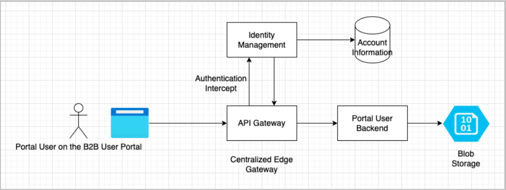

# Service Architecture

SpatioSynth consists of several reusable building blocks. Read on to learn more about the microservice building blocks architecture.

## Microservice - Building Blocks

<figure><figcaption></figcaption></figure>

We will look at each block of the above later in [Core Services](../core-services/api-gateway.md).

## System Architecture

<figure><figcaption></figcaption></figure>

### **AI/ML Integration Architecture Overview**

This architecture illustrates how legacy systems and modern portal users interact with a centralized AI/ML engine through a shared application portal and API gateway. It supports user-level control, profile management, and credit-based access to ML services.

***

#### **1. User Sources**

* **Legacy Application Users**: Existing users from legacy systems interact directly with the **ML/API Gateway**.
* **Portal Users**: End-users access services through a modern **B2B Application Portal**, which acts as the entry point for new requests.

***

#### **2. Application Portal**

* The **B2B Application Portal** is the main interface for portal users.
* It forwards all requests to the **Business Logic** layer, which handles application-specific rules, validation, and routing.

***

#### **3. Business Logic Layer**

* Acts as the core of the system.
* Processes incoming requests from the portal.
* Interfaces with:
  * **User Profile Data** for retrieving/storing user-specific information.
  * **User Datasets** for storing the data generated or uploaded by users.
  * **ML/API Gateway** for forwarding valid ML service requests.

***

#### **4. ML / API Gateway**

* Central gateway for routing requests to the ML services.
* Validates and tracks **API Call Credits** to ensure fair usage and monetization.
* Forwards validated requests to the **AI/ML Engine**.

***

#### **5. AI / ML Engine**

* Consists of two main components:
  * **Facade**: Handles incoming requests and abstracts the complexity of internal algorithm logic.
  * **AI / ML Algorithms**: Performs predictions, classifications, or any required ML tasks using data.
* Uses **Base Algorithm Datasets** for training and inference support.

***

#### **6. Data Flow**

* **User Profile Data**: Stores metadata and credentials related to users, used for personalization and authentication.
* **User Datasets**: Stores user-uploaded or generated datasets needed for AI/ML tasks.
* **Base Algorithm Datasets**: Core datasets used internally by ML algorithms for training, inference, or benchmarking.

***

#### **Summary**

This architecture ensures:

* Centralized access to AI/ML services from both modern and legacy systems.
* Scalable and secure API call management using credit-based tracking.
* Clean separation of business logic and machine learning operations.
* Modular components that allow easy extension and maintainability

## System Users

* Portal Standard User : This user will login to the B2B Portal to run ML APIs.
* Portal Oganization Admin User : This user will login to the B2B Portal to run ML APIs,
  \
  additionally, this user will create organization and invite other users to share it’s credits
  \
  and datasets.
* Portal Admin : This is an internal user who will see reporting information and have
  \
  access to the platform management features.
* API User : This user will login to the B2B Portal to gain access to the ML APIs API Key’s
  \
  and Secrets to enable access for it’s developers.
* ML API Admin : This user will login to the ML API Management Portal to view API
  \
  Analytics, logs and provisioning new API and manage versioning of APIs.

## Logical Architecture Overview

This section describes the top level software components and their interactions/relationships.

### User - IAM Flow

<figure><figcaption></figcaption></figure>

Portal user requests are intercepted at the Gateway and forwarded to Identity Management for
\
authentication and authorization. IAM Gateway may mark a request forbidden or Un Authorized
\
in case the user tokens fail to validate. Upon Success API Gateway will forward the request to the
\
Portal User Backend for further processing.

Note: : It is important the Portal Backend is behind an API Gateway. This will allow the system to
\
scale in the future. The API Gateway could be a central gateway with caching support.

### Legacy App Flow

<figure><figcaption></figcaption></figure>

Legacy Apps will use API Key and Secret to connect to the Core ML API. The ML API Gateway will
\
authenticate the API Key and Secret and ensure credit availability before making the API Call or
\
else return an appropriate error response.

### ML API Access Flow

<figure><figcaption></figcaption></figure>

Both Portal user’s and API user’s access the Core ML API. The ML API is the system’s core
\
functionality and monetized using a credit system. Each ML API could be differently monetized
\
and the system must have support for monetization policy built into the Core ML subsystem.

### Complete System View

<figure><figcaption></figcaption></figure>
